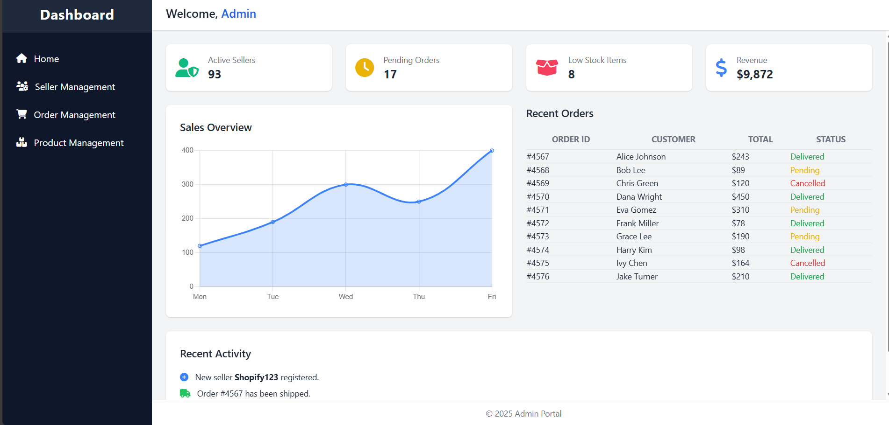
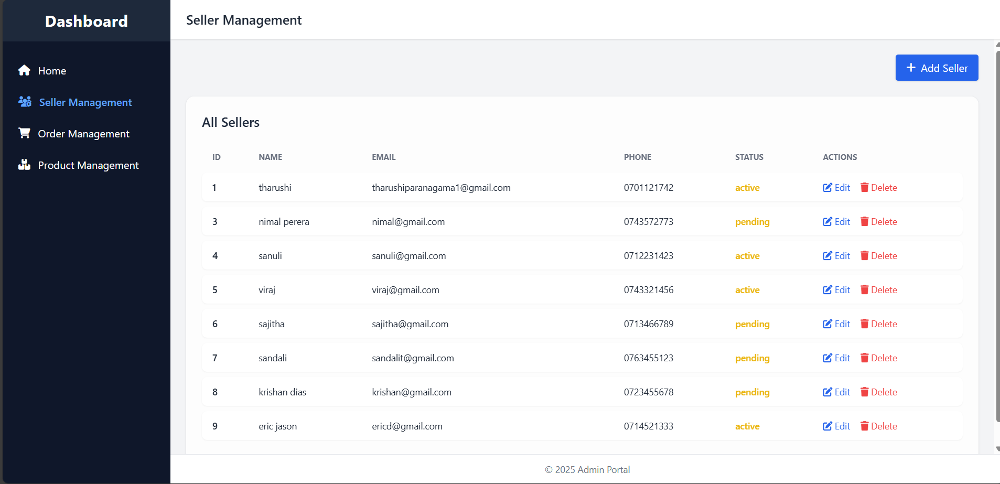

# Seller Management System 🚀

A simple Java-based project to learn CRUD operations and basic admin dashboard functionalities. This system focuses mainly on managing sellers with create, read, update, and delete features.

---

## About 💡

This project is a Seller Management System developed in Java to practice and demonstrate CRUD operations. It includes a basic admin dashboard with a home page, where the admin can add, edit, delete, and view all sellers in a tabular format.

---

### 🔷 Admin Dashboard

Here is the main admin dashboard UI where you can see key stats and navigation.



---

### 🔷 Seller Management

This page lists all sellers in a table with options to add, edit, and delete sellers.




## Features ⭐

- 🛠️ Admin dashboard with home page  
- ➕ Add new sellers via a form  
- 📋 Display all sellers in an organized table  
- ✏️ Edit and update seller details  
- 🗑️ Delete sellers from the system

---

## Installation & Running ⚙️

1. Clone this repository:  
   ```bash
   https://github.com/Tharushi111/Seller-Management-System

2. Open the project in your preferred Java IDE (Eclipse, IntelliJ IDEA, NetBeans).

3. Make sure you have JDK installed (Java 8 or higher).
4. Set up MySQL Database

   - Create a database named: sellermanagementsystem

   - Create a table named sellers with the following schema:

     ```bash
        CREATE TABLE sellers (
        id INT AUTO_INCREMENT PRIMARY KEY,
        name VARCHAR(100),
        email VARCHAR(100),
        phone VARCHAR(20),
        status VARCHAR(20),
        created_at TIMESTAMP DEFAULT CURRENT_TIMESTAMP,
        updated_at TIMESTAMP DEFAULT CURRENT_TIMESTAMP ON UPDATE CURRENT_TIMESTAMP
      );

5. Configure Database in DBConnection.java

   - Set your MySQL username and password:

     ```bash
       private static final String JDBC_USERNAME = "root";
       private static final String JDBC_PASSWORD = "your_password";


6. Run the project.

## How to Use 📝

- Navigate to the Admin Dashboard, Seller Management page to view all sellers in a table.

- Click the Add Seller button to open a new seller form and input new seller details.

- Use the Edit buttons next to each seller entry to update information.

- Use the Delete buttons to remove sellers from the system.

##  Technologies Used 💻

- Java (JDK 8+) — Core programming language

- Java Servlet / JSP — For server-side logic and UI 

- HTML & CSS — Frontend layout and styling

- JDBC — Database connectivity for CRUD operations

- IDE: Eclipse

##  Purpose 🎯

- This project was built for learning and practicing CRUD functionality in Java along with simple UI management. It is not a full-fledged web application but a basic management system focusing on seller data handling.

## License 📄
- This project is for educational and personal learning purposes. Feel free to use and modify it according to your needs.

## Contact 📬
- If you have any questions or feedback, feel free to reach out via GitHub.

